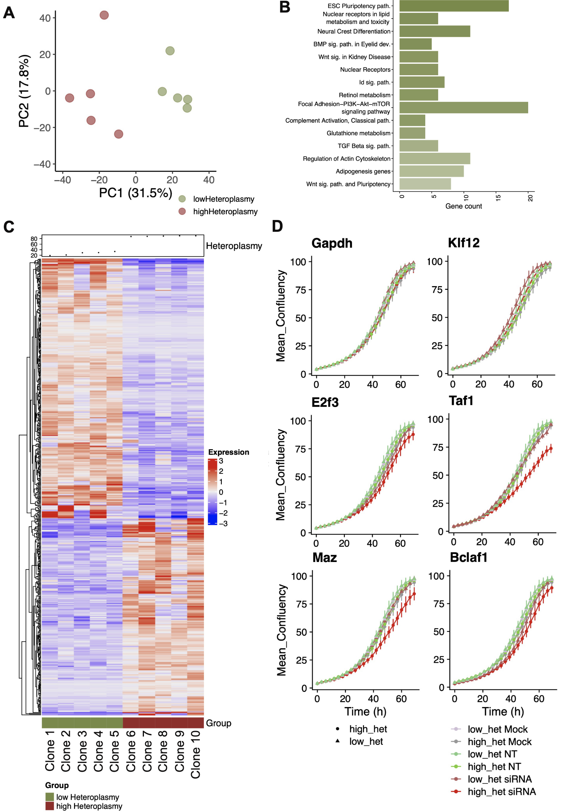

# Cell lineage specific mitochondrial resilience during mammalian organogenesis

**Stephen P. Burr1,2¶ , Florian Klimm1,2,3,4,5,6¶ , Angelos Glynos1,2¶ , Malwina Prater1,2¶ , Pamella Sendon7, Pavel Nash2, Christopher A. Powell2, Marie-Lune Simard7, Nina A. Bonekamp7,8, Julia Charl9, Hector Diaz10, Lyuba Bozhilova1,2, Nell Nie1,2, Haixin Zhang1,2, Michele Frison1,2, Maria Falkenberg10, Michal Minczuk2, Nick Jones3, James B. Stewart7,11, Patrick F. Chinnery1,2*.**

1 Department of Clinical Neurosciences, School of Clinical Medicine, University of Cambridge, Cambridge Biomedical Campus, Cambridge, UK.
2 Medical Research Council Mitochondrial Biology Unit, University of Cambridge, Cambridge Biomedical Campus, Cambridge, UK
3 Department of Mathematics, Imperial College London, London, UK
4 EPSRC Centre for Mathematics of Precision Healthcare, Imperial College, London, UK
5 Department of Computational Molecular Biology, Max Planck Institute for Molecular Genetics, Ihnestraße 63-73, D-14195, Berlin, Germany
6 Department of Computer Science, Freie Universität Berlin, Arnimallee 3, D-14195 Berlin, Germany
7 Max Planck Institute for Biology of Ageing, Cologne, Germany
8 Department of Neuroanatomy, Mannheim Centre for Translational Neuroscience (MCTN), Medical Faculty Mannheim/ Heidelberg University
9 Institute of Biochemistry, University of Cologne, Otto-Fischer-Strasse 12-14, Cologne, Germany
10 Department of Medical Biochemistry and Cell Biology, University of Gothenburg, PO Box 440, Gothenburg 405 30, Sweden
11 Biosciences Institute, Faculty of Medical Sciences, Wellcome Centre for Mitochondrial Research, Newcastle University, Newcastle upon Tyne, UK

¶ Equal contributions
* Correspondence: pfc25@cam.ac.uk

### Publication ###

Burr, S., Klimm, F., Glynos, A., Prater, M., Sendon, P., Nash, P., Powell, C., Simard, M., Bonekamp, N., Charl, J., Diaz, H., Bozhilova, L., Nie, N., Zhang, H., Frison, M., Falkenberg, M., Minczuk, M., Jones, N., Stewart, J., Chinnery, P. (2022) Cell lineage specific mitochondrial resilience during mammalian organogenesis. [[Cell]](LINK-to-page) [[DOI]](DOI-address-html)

# Software

| Reference             | Software     | DOI   |
|---------------------- |--------------|-------|
|Hao et al., 2021       | Seurat v4    | https://doi.org/10.1016/j.cell.2021.04.048 |
|Dobin et al., 2013     | STAR aligner | https://doi.org/10.1093/bioinformatics/bts635 |
|Aibar et al., 2017     | SCENIC       | https://doi.org/10.1038/nmeth.4463 |
|Korsunsky et al, 2019  | Harmony      | https://doi.org/10.1038/s41592-019-0619-0 |
|Simon Andrews          | FastQC       | https://www.bioinformatics.babraham.ac.uk/projects/fastqc/ |
|Ewels et al, 2016      | MultiQC      | https://doi.org/10.1093/bioinformatics/btw354 |

------------------------------------------------
# Methods

### Quality control and pre-processing of scRNA-seq

Raw FASTQ files from 10x sequencing were demultiplexed and aligned in a two-pass alignment to the Mus musculus reference genome (version Mus_musculus.GRCm38.102) using STARsolo (version 2.7.3a) (Dobin et al., 2013), with default settings set according to the 10x chromium chemistry used. For the expression matrix analysis, we used Seurat (version v.4.0.5) (Hao et al., 2021) and perform standard pre-processing steps: removing cells with less than 200 genes, removing genes that have been detected in less than 3 cells, normalisation to 10,000 reads per cell, and log-transformation. After this quality control, we have 11020 cells in total.

**Table 1:** Number of cells after alignment and pre-processing in both batches. Batch A consists of Wildtype and the 5024 mutation. Batch B consists of Wildtype, 5019, and 5014 mutation. In total 11020 cells pass the quality control filtering.

| Batch A: Wildtype	| Batch A: 5024 mutation	| Batch B: Wildtype |	Batch B: 5019 mutation | Batch B: 5024 mutation |
| ---- | ---- |---- | ---- |---- |  
| 2174	| 2456	| 2750 |	1649	|  1991 |

### Clustering and cell-type annotation of the scRNA-seq

To cluster the cells with Scanpy, we first construct a k-nearest-neighbour graph with the default k=15 and, second, perform a modularity maximisation with resolution parameter 10. For each cluster, we then identify differentially expressed genes (DEGs) with a Wilcoxon rank-sum tests, for which we choose a significance threshold of 0.05 for and use the Benjamini–Hochberg procedure to obtain multiple-testing corrected p-values. To annotate each cluster with a cell type, we compare the obtained top 100 DEGs with the top 100 marker genes as identified by (Ibarra-Soria et al., 2018). Specifically, for each cluster, we compute the Jaccard index between the DEGs and each of the twenty cell types and then assign the cell type with the highest Jaccard index to this cluster.

For data processing for identifying marker genes, SCENIC and data visualisation on UMAP, raw counts were processed using Seurat (v.4.0.5) and SCTransform (sctransform R package, v.0.3.2) with regressing out batch effect, followed by Harmony (v.0.1.0). SCENIC analysis (Aibar et al., 2017) was performed on the integrated dataset using SCENIC R package (v.1.2.4) and python Arboreto module (v.0.1.5). Cell-type-specific, and cell-type-and-genotype-specific marker genes were calculated with Seurat function "FindMarkers", using a Wilcoxon rank-sum test with a significance threshold of 0.05 and use of the Benjamini–Hochberg procedure to obtain multiple-testing corrected p-values.

Enrichment with buffering genes from (To et al., 2019) and (Mennuni et al., 2021) was performed for each cell type & genotype specific markers (also for each regulon genes) using hypergeometric test with adjusting for multiple testing (Holm method). Heatmaps were produced using R package ComplexHeatmap (v.2.8.0) with hierarchical clustering using euclidean distance (for grouped by cell type- fig 6, or individual cell type like in fig.7a). Pathway analysis was performed using enrichR R package (v.3.0).

### Correlation Analysis

Pearson correlation of genes involved in oxidative phosphorylation (as annotated in mouse MitoCarta v3) was calculated separately for WT, m.5019A>G and m.5024C>T embryos, for selected cell types. To measure the number of correlated gene pairs (right) for each genotype, correlation data was binarised with a cut-off of > 0.5 for correlation coefficient r2, to count presence or absence of correlation between pairs of genes. Quantile-quantile (qq) plots were created to visually inspect changes in gene pair correlations between WT and mutant genotypes.

### Analysis of additional datasets

Publically available datasets used:

| Reference             | Dataset         | DOI    |
|---------------------- |---------------- |------- |
| The Tabula Muris Consortium, 2020 | The Tabula Muris Consortium | https://doi.org/10.1038/s41586-020-2496-1  |
| Lai et al, 2021                   | GSE160312                   | https://doi.org/10.1038/s41419-021-04099-4 |
| Saur et al, 2021                  | GSE152687                   | https://doi.org/10.1002/glia.23973         |

The Tabula Muris Consortium data was used to compare with expression of genes involved in oxidative phosphorylation in E8.5 WT mouse embryo. Bulk RNA-seq stages: 1 month and 9 month old, were selected because there were highest number of replicates for these stages and they were representing post-natal young and adult mouse.
Raw counts were processed with DESeq2, and variance stabilizing transformation was used to visualise gene expression on the heatmap together with the mouse embryo.

In order to validate genes identified in SCENIC regulons, Sox10 regulon. Two separate Sox10 siRNA RNA-seq datasets (GSE160312 in human pluripotent stem cells, and GSE152687 in mouse Schwann cells) were used to identify genes regulated by the transcription factor (TF) Sox10, and were compared with the SCENIC Sox10 regulon genes that were predicted to be regulated by Sox10 TF. For each regulon identitied by SCENIC (with minimum 30 genes), percentage of overlap with the siRNA datasets was calculated, and plotted as a line-plot with regulons ordered by the percent overlap.

### MEFs clones used for bulk RNA-seq and siRNA proliferation assay.

For the bulk RNA-seq and the proliferation assay of siRNA treated cells, 10 clones of MEFs were used (5 clones with high heteroplasmy and 5 clones with low heteroplasmy).

Table with clones and their respective heteroplasmy levels.

| Clone    |  Heteroplasmy (%)|
|----------|------------------|
|clone_62  | 88|
|clone_59  | 89|
|clone_44  | 91|
|clone_83  | 89|
|clone_26  | 88|
|clone_101 | 19|
|clone_109 | 31|
|clone_12  | 34|
|clone_33  | 23|
|clone_48  | 30|

### Quality control and pre-processing of bulk RNA-seq

QC of the sequencing was assessed using FastQC (v0.11.9), fastq_screen (v0.14.1), Qualimap (v.2.2.1) and summarised with MultiQC (v1.11). Reads were aligned to the human genome (GRCh38) with STAR aligner (v2.7.8a), with a mean of 87.4% reads uniquely mapping and mean of 12.4M paired reads/sample. Gene quantification was determined with STAR.

### Bulk RNAseq analysis
Counts extracted with STAR were used to perform differential gene analysis in R (version 4.2.1) using package DESeq2 (v.1.36.0). Since the samples were sequenced in pool on 2 separate lanes, counts were combined using DESeq2 function "collapseReplicates". Genes with no expression were filtered out. Read counts were normalised on estimated size factors. Fold changes were calculated with function lfcShrink using estimator "ashr". Principal component analysis (PCA) was performed on rlog-transformed count data for all genes. GO enrichment analysis was performed using enrichR package (v.3.1) and Kegg pathway analysis using clusterProfiler (v.4.4.4), on DEGs with absolute log2 fold change >1 and adjusted P value <0.05.

### Proliferation assays

Two independently conducted proliferation experiments were merged, and means for each clone calculated.
For the late time point (60h), Pearson correlation was used to assess correlation between heteroplasmy and mean confluency. Two statistical methods were used to assess change in confluency due to heteroplasmy levels: t-test at the late time point (60h) and area under curves (AUC). Statistical results are shown in tables below.

| siRNA|t_test pval	| t_test 60h padj (FDR) |	t_test 60h padj (bonferroni) |
|----- |----------  | ------------------    | --------------               |
|Mock	 |  0.204195132 |	0.272260176	| 1 |
|NT	   |  0.376859211	| 0.376859211	| 1 |
|Gapdh |  0.158374855	| 0.272260176	| 1 |
|E2f3	 |  0.202931742	| 0.272260176	| 1 |
|Taf1	 |  0.000365616	| 0.002924925	| 0.002924925 |
|Klf12 |  0.33204861	| 0.376859211	| 1 |
|Maz	 |  0.006081063	| 0.02432425	| 0.0486485 |
|Bclaf1|	0.176320192	| 0.272260176	| 1 |

| siRNA|AUC pval	| AUC 60h padj (FDR) |	AUC 60h padj (bonferroni) |
|----- |----------  | ------------------    | --------------               |
| Mock	 | 0.994117853	|0.994117853	|1 |
| NT	   | 0.441088966	|0.594961414	|1 |
| Gapdh	 | 0.779878752	|0.891290003	|1 |
| E2f3	 | 0.146853883	|0.482486722	|1 |
| Taf1	 | 0.008167221	|0.065337767	|0.065337767 |
| Klf12	 | 0.401073059	|0.594961414	|1 |
| Maz	   | 0.180932521	|0.482486722	|1 |
| Bclaf1 | 0.446221061	|0.594961414	|1 |

------------------------------------------------

# Results

## Batch correction E8.5 mouse embryo dataset

**Batch correction with SCtransform and Harmony**

 
[Download PDF Version](scRNAseq_mouse_E8.5/MBU_spb54_005__SCENIC_Multi_UMAP_QC___SCT__regressed.pdf)

The batch effect was removed using SCTransform and Harmony. Neither cell cycle phase nor MT content was regressed out.

## Differential expression of nuclear-encoded mitochondrial genes during organogenesis in WT E8.5 mouse embryos

**Figure 1B.**

 

Figure 1B. UMAP of single-cell transcripts defining ectodermal, endodermal and mesodermal cell lineages based on Pou3f1 (blue), Foxa1 (yellow) and Pdgfra (magenta) expression respectively.

**Figure 1C & D.**

 

Figure 1C. Left = UMAP showing 17 different cell lineages, defined by unbiased analysis of known marker-gene transcript expression levels. Each dot represents a single cell. Right = Number of cells in each lineage.

Figure 1D. Abundance of mtDNA-encoded transcripts across different cell types, showing significant differential gene expression in 5 of the 17 lineages. Colours match the lineages defined in (C). * = p < 0.05.

**Figure 1E & 1F.**

 

[Download PDF Version of 1E](scRNAseq_mouse_E8.5/Figure_1E.pdf)

[Download PDF Version of 1F](scRNAseq_mouse_E8.5/Figure_1F.pdf)

Figure 1E. Violin plots showing transcript abundance of selected nuclear-encoded mitochondrial genes Grsf1, Chchd10 & Slc25a4, showing significant differential expression across the 17 cell lineages. * = p < 0.05. Selected genes represent the top three most differentially regulated transcripts across at least two cell lineages. p-values for all nuclear mitochondrial genes with significant differential expression in at least one cell lineage can be found in (Table S1)

Figure 1F. Heatmap showing expression levels of known electron transport chain (ETC) subunit gene isoforms in bulk RNAseq from adult mouse tissues (left) and single-cell RNAseq from E8.5 embryonic cell lineages (right). Strong expression of the muscle isoforms Cox7a1 & Cox6a2 is seen in embryonic cells of the cardiac lineage, revealing that the heart/muscle-specific expression pattern of these isoforms seen in adult tissues is already established by the early stages of organogenesis.
UMAP = Uniform Manifold Approximation and Projection.

**Related supplementary figure S1.**

 

[Download violin plots Figure S1B](scRNAseq_mouse_E8.5/Figure_S1B.pdf)

[Download heatmap Figure S1D](scRNAseq_mouse_E8.5/Figure_S1D.png)

(B) Violin plots showing expression profiles of selected nuclear-encoded mitochondrial genes Ndufb5, Timm44 & Cox10, showing no significant differential expression across the 17 cell lineages.

(C) Dotplot showing relative expression of the Cox6a1, Cox6a2, Cox7a1 & Cox7a2 gene isoforms in the 17 identified cell lineages of WT E8.5 embryos. Diameter of each dot is proportional to the percentage of cells expressing each isoform in the corresponding lineage, darker shading indicates higher average expression in that lineage.

(D) Heatmap showing relative expression of the heart/muscle specific Complex IV subunit isoforms Cox7a1 and Cox6a2 in WT E8.5 cardiac lineage cells. The majority of Cox6a2 expressing cells also express Cox7a1, suggesting co-expression of the two isoforms in early cardiomyocytes.

## mt-Ta variants induce an embryo-wide transcriptional response.

**Figure 3A & 3B. Pseudobulk analysis.**

 

Figure 3A. Bar charts showing selected KEGG pathways enriched (adjusted p < 0.05) for transcripts with significant differential expression in the three pairwise comparisons of WT, m.5024C>T and m.5019A>G. Bar colours indicate the number of upregulated pathway genes for the corresponding strain in each comparison.

Figure 3B. Violin plots showing mtDNA transcript expression levels in WT, m.5024C>T and m.5019A>G mouse cells across the 17 identified cell lineages. * = p < 0.05 (mutant vs. WT).

**Figure 3C & 3D.**

 

Figure 3C. Bar chart displaying the fraction of cells committed to each cell of the 17 identified cell lineages in WT, m.5019A>G and m.5024C>T mouse embryos at E8.5.

Figure 3D. Violin plots displaying the transcriptional profile of selected lineage-specific marker genes Wnt6, Six3 and Tcf15 in their respective cell types in WT, m.5024C>T and m.5019A>G mice, showing no significant differences in expression of these lineage-defining genes.
WT = Wild-type.

**Related supplementary figure S4.**

 

[Download Heatmap Figure S4F](scRNAseq_mouse_E8.5/Figure_S4F_sex.png)

[Download Venn Figure S4H](scRNAseq_mouse_E8.5/Figure_S4H.pdf)

(F) Heatmap showing relative expression levels of mtDNA and nuclear encoded mitochondrial gene transcripts in m.5019A>G, m.5024C>T and wild-type (WT) embryonic cells.

(H) Venn diagram showing the intersection between published genetic modifiers of mitochondrial dysfunction identified through an in vitro CRISPR screen (Mennuni et al., grey) and dysregulated genes in m.5019A>G (blue) and m.5024C>T (red) embryos.

**Related supplementary figure S5.**

 
[Download Figure S5A](scRNAseq_mouse_E8.5/Figure_S5A.png)

(A) Top 20 most upregulated genes, ranked left to right by relative transcript expression score (-log10(p.adj) * abs(l2fc)) compared to WT, in the mid hindbrain and mixed mesoderm lineages for both m.5019A>G and m.5024C>T embryos. Ranked lists for other lineages can be found in (Table S5)

## Intra- and extra-organellar buffering in response to the mt-Ta mutations

**Figure 4A.**

 
[Download PDF Version](scRNAseq_mouse_E8/Figure_4A.pdf)

Figure 4A. Venn diagram showing the intersection between published genetic modifiers of mitochondrial dysfunction identified through an in vitro CRISPR screen (To et al., grey) and dysregulated genes in m.5019A>G (blue) and m.5024C>T (red) embryos. A list of these intersecting genes with corresponding p-values can be found in (Table S3).

**Figure 4C.**

 
[Download PDF Version](scRNAseq_mouse_E8.5/Figure_4C.pdf)

Figure 4C. Dot plot showing relative expression levels of 17 epistatic buffer/suppressor genes identified in the in vitro CRISPR screen that were significantly downregulated in at least one mutant strain when compared to WT. Genes labelled in green are annotated in the Mouse MitoCarta3.0 inventory.

**Figure 4E.**

 
[Download PDF Version](scRNAseq_mouse_E8.5/Figure_4E.pdf)

Figure 4E. Violin plots showing pseudo-bulk expression profiles of specific mtDNA and nuclear gene transcripts encoding mitochondrial proteins in WT, m.5024C>T and m.5019A>G embryos. ** = p < 0.01

**Figure 4F.**

 
[Download PDF Version of fig 4F Heatmap](scRNAseq_mouse_E8.5/Figure_4F.pdf)

Figure 4F. Heatmap showing significantly enriched WikiPathways (2019 mouse annotation), based on differentially regulated genes in at least one cell lineage in m.5019A>G and m.5024C>T embryos compared to WT. mRNA processing, pluripotency and ribosomal protein genes are enriched across multiple lineages in both mutants, whilst other pathways show lineage- and strain-specific enrichment. p < 0.05 for all green squares.

**Related supplementary figure S5.**

 
[Download Heatmap Figure S5B](scRNAseq_mouse_E8.5/Figure_S5B.pdf)

(B) Heatmap showing significantly enriched GO Biological Processes (2018 annotation), based on differentially regulated genes for each cell lineage in m.5024C>T and m.5019A>G embryos compared to WT. p < 0.05 for all green squares.

**Figure 4G.**

 
[Download PDF Version](scRNAseq_mouse_E8.5/Figure_4G.pdf)

Heatmap showing enrichment of identified epistatic buffers/suppressors amongst genes that are downregulated in m.5019A>G and m.5024C>T mutants compared to WT across all cell lineages. m.5024C>T embryos show a stronger downregulation signature than m.5019A>G embryos, perhaps representing a stronger compensatory response to mitochondrial dysfunction. p < 0.05 for all green bars.

WT = Wild-type, CRISPR = Clustered Regularly Interspaced Short Palindromic Repeats, OXPHOS = Oxidative Phosphorylation.

## Mutation- and cell lineage-specific differential expression of epistatic buffer/suppressor genes

**Figure 5A.**

 
[Download PDF Version](scRNAseq_mouse_E8/Figure_5A.pdf)

Figure 5A. Heatmap showing relative expression levels of 51 epistatic buffer/suppressor genes identified in CRISPR knockout screens, filtered to show genes that exhibit differential expression patterns between WT and m.5024C>T or m.5019A>G. Filters applied on scaled gene expression: Minimum difference between mutant - WT < -0.2, and maximum for the scaled gene expression > 0.5 for at least 1 cell type, across all cell lineages and mouse strains.

**Figure 5B.**

 
[Download PDF Version](scRNAseq_mouse_E8.5/Figure_5B_S6C.pdf)

Figure 5B. Correlation of genes involved in oxidative phosphorylation for selected cell types. Heatmaps showing Pearson correlation strength between OXPHOS genes separately for WT, m.5019A>G and m.5024C>T embryos (left) and barplot showing binarised correlation as a measure of number of correlated gene pairs (right). A cut-off of > 0.5 for correlation coefficient r2 was applied to count presence or absence of correlation between pairs of genes.

WT = Wild-type, OXPHOS = Oxidative Phosphorylation.

## Cell lineage-specific compensatory mechanisms are coordinated by gene regulatory networks

**Figure 6A.**

 

[Download PDF Version of fig 6A Heatmap](scRNAseq_mouse_E8.5/Figure_6A.pdf)

[Download PDF Version of fig 6B Gata4](scRNAseq_mouse_E8.5/Figure_6B_Gata4.pdf)

[Download PDF Version of fig 6B Foxa3](scRNAseq_mouse_E8.5/Figure_6B_Foxa3.pdf)

[Download PDF Version of fig 6C Mecom](scRNAseq_mouse_E8.5/Figure_6C_Mecom.pdf)

[Download PDF Version of fig 6C Sox9](scRNAseq_mouse_E8.5/Figure_6C_Sox9.pdf)

[Download PDF Version of fig 6C Sox10](scRNAseq_mouse_E8.5/Figure_6C_Sox10.pdf)

(A) Heatmap of selected SCENIC regulon activity across all cell lineages in WT, m.5024C>T and m.5019A>G mice, showing lineage-specific transcriptional activation patterns. Number in brackets is the number of genes (g) identified with high confidence in each regulon.

(B) UMAPs showing localised activity of the heart-specific Gata4 transcription factor in the cardiac lineage and Foxa3 activity, required for liver development from gut endoderm, in the intestinal lineages. WT, m.5024C>T and m.5019A>G cells are overlaid on the same UMAP. Grey/pink = Increased regulon activity.

(C) UMAPs showing differential lineage-specific activity of the Mecom (endothelial, less active), Sox9 (neural crest, more active) and Sox 10 (neural crest, more active) regulons in m.5024C>T and m.5019A>G mice compared to WT. In the main UMAP, WT, m.5024C>T and m.5019A>G cells are overlaid, with each mouse strain displayed separately in the expanded panels.

**Figure S7 Cell lineage-specific compensatory mechanisms are coordinated by gene regulatory networks, related to Figures 6 & 7**

 
[Download PDF Version](scRNAseq_mouse_E8.5/Figure_S7A.pdf)

(A) SCENIC heatmap showing binary activity of identified regulons. A regulon is defined as ‘active’ by having a minimum of 50% cells showing regulon activity in at least one group. Both embryo-wide and lineage-specific patterns of regulon activity are seen in addition to mutation specific signatures for some regulons.

 
[Download PDF Version](scRNAseq_mouse_E8.5/Figure_S7C_1.pdf)
[Download PDF Version](scRNAseq_mouse_E8.5/Figure_S7C_2.pdf)

(C) Scatter plots showing the percentage overlap between marker genes in SCENIC regulons (Figure S7A) and differentially regulated genes identified in two published RNAseq datasets comparing WT and Sox10 knockdown in human and mouse neural crest-derived cells. Neural crest-specific regulons identified by SCENIC, including Sox10, Sox9, Tfap2a & Tfap2c, were amongst those with the highest overlap, confirming the validity of the SCENIC analysis.

**Figure 6D.**

 

(D) Network displaying differentially expressed marker genes identified in the Sox9 and Sox 10 regulons in the neural crest lineage in m.5024C>T and m.5019A>G mice, with just under half of the identified marker genes (24/56) being shared by both mutant strains. Lines between circles and boxes indicate the regulon(s) associated with that gene. Lines between circles indicate predicted protein-protein interactions. Red text indicates genes involved in neural crest differentiation.

WT = Wild-type, UMAP = Uniform Manifold Approximation and Projection.

## Knockdown of key in vivo regulon transcription factors results in heteroplasmy-dependent proliferation defects in an in vitro cell model

**Figure 7A.**

 

[Download PDF Version of fig 7A](bulk_RNAseq_MEFs/Figure_7A.pdf)

[Download PDF Version of fig 7B](bulk_RNAseq_MEFs/Figure_7B.pdf)

[Download PDF Version of fig 7C](bulk_RNAseq_MEFs/Figure_7C.pdf)

[Download PDF Version of fig 7D](siRNA_MEFs/Figure_7D.pdf)

[Download volcano plot](siRNA_MEFs/Figure_7_related_volcano.pdf)

(A) PCA plot of bulk RNAseq data from ten clonal populations of m.5024C>T MEF cells shows differential clustering of clones based on heteroplasmy level. Low heteroplasmy < 35%, high heteroplasmy > 80%

(B) Bar chart showing WikiPathways (2019 mouse annotation) significantly enriched for genes differentially expressed between low and high heteroplasmy m.5024C>T MEF clones. Several of these, including various signalling and pluripotency pathways, overlap with those seen in m.5024C>T E8.5 embryonic cell lineages (Figure 4F).

(C) Heatmap of genes with significant differential expression between low and high heteroplasmy m.5024C>T MEF clones, highlighting the widespread transcriptional differences between the two groups.

(D) Growth curves showing proliferation rates of low and high heteroplasmy m.5024C>T MEF clones that were left untreated (mock), transfected with a non-targeting siRNA pool (NT) or transfected with an siRNA pool to the indicated gene (siRNA). Mock and NT treated clones showed no reduction in proliferation rate, as was the case for clones targeted with siRNA to Gapdh (control housekeeping gene) and Klf12. In clones transfected with siRNA to E2f3, Taf1, Maz & Bclaf1 there was reduced proliferation that was more marked in high heteroplasmy clones. Plots show combined proliferation data from 5 low heteroplasmy and 5 high heteroplasmy clones gathered across two separate siRNA knockdowns per clone.

PCA = Principle Component Analysis, MEF = Mouse Embryonic Fibroblast, siRNA = Small Interfering RNA

### Integrated Stress Response

**Supplementary figure S6B**

 

(B) Heatmap showing relative expression levels of ISRmt genes in WT, m.5024C>T and m.5019A>G cells across all cell lineages. Transcription of the key ISRmt regulator Atf4 was downregulated in multiple lineages, particularly in m.5019A>G cells, suggesting that ISRmt is not activated in the mutant strains. ISRmt gene list consists of genes annotated under the Gene Ontology term ‘Integrated Stress Response Signalling’ (GO ID: 0140467) plus known Atf4 target genes (Quiros et al., 2017). * = p<0.05
